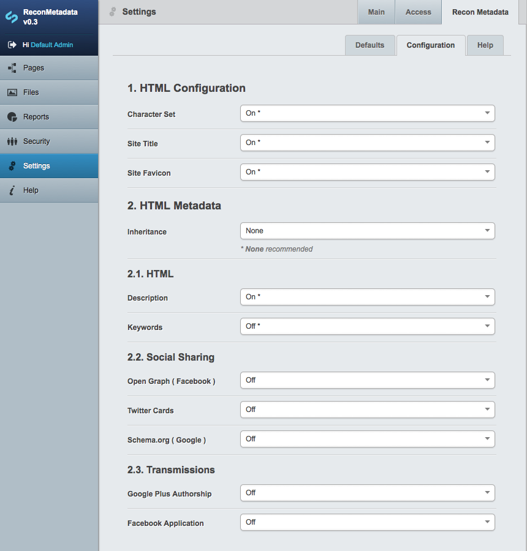

SSSEO v1
========

This is a module for use with the Silverstripe framework & CMS v3.1.*

It is meant to provide a comprehensive-as-you-need, not-too-intimidating interface for adding extended metadata to pages.

It uses as many **best practises** as possible, while also trying to be as **browser compatible** possible, but this is never an exact science...

## 1. Installation

Place the SSSEO folder in your SilverStripe root and run **~/dev/build/?flush=ALL**.

## 2. Configuration

Configuration is modular and managed via extensions in the **~/SSSEO/_config/config.yml** file.

Remember to **~/dev/build/?flush=ALL** if any changes are made to the YAML file!

## 3. Template Usage

Remove extraneous metadata from you *Page.ss templates.

Insert:

> $Metadata()

Just below the opening **&lt;head&gt;** tag, and below **$BaseHref()** if present.

And, Bob's your uncle :)'

## 4. Extensions

### 4.1. Core ( HTML Metadata )

By default, all core modules should be included, these are:

> SSSEO_Core_SiteConfig_DataExtension

> SSSEO_Core_LeftAndMain_DataExtension

> SSSEO_Core_SiteTree_DataExtension

This will enable the bulk of the **'default'** functionality pertaining to HTML metadata: character sets, titles, rel="canonical", favicon.ico and custom metadata.

### 4.2. Open Graph

To include Open Graph functionality, include:

> SSSEO_OpenGraph_SiteTree_DataExtension

@note: only type **'article'** is supported for now, more types coming in future versions.

### 4.4. Twitter Cards

To include Twitter Cards functionality, include:

> SSSEO_TwitterCards_SiteTree_DataExtension

@note: only type **'summary'** is supported for now, more types coming in future versions.

### 4.4. Schema.org

@note: to be implemented in future versions.

### 4.5. Facebook Application

@note: to be implemented in future versions.

### 4.6. Apple Touch Icons + Android rel="icon"

@note: to be implemented in future versions.

### 4.7. Authorship

Authorship functionality involves **rel="author"** and **rel="publisher"**, as well as Open Graph functionality (**article:author** and **article:publisher**) if the Open Graph submodule is enabled.

@note: further functionality regarding published and edited dates and times to be added.
