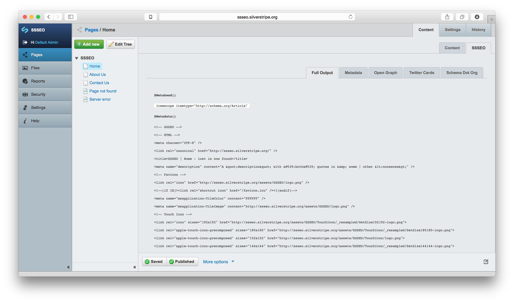

SSSEO v1
========

This is a module for use with the SilverStripe v3.1.* framework & CMS

It is meant to provide a comprehensive-as-you-need, and yet not-too-intimidating interface for adding extended metadata to pages, based largely on [18 Meta Tags Every Webpage Should Have in 2013][1], including some additional enhancements with **_Favicons_** and **_Touch Icons_**.

Also, a good overview: [5 tips for SEO with Silverstripe 3][2]

Best practises nonsense - check!

Browser compatibility nonsense - check!



## 1. Installation

Place the SSSEO folder in your SilverStripe root and run `~/dev/build/?flush=ALL`.

## 2. Configuration

Configuration is modular and managed via extensions in the `~/SSSEO/_config/config.yml` file.

Copy the `~/SSSEO/_config/config.yml` file into your `~/mysite/_config/` folder to enable submodules, or they will be disabled every time you update SSSEO. The information will however remain even if submodules are removed, so if you forget, it's not the end of the world - simply re-enable whichever modules.

Remember to `~/dev/build/?flush=ALL` if you modify any YAML files.

## 3. Template Usage

Remove extraneous metadata from your `$ThemeDir()/templates/*Page.ss` templates.

2 call are necessary:

+ `$Metahead()` inside the opening `<head>` tag

+ `$Metadata()` just below the opening `<head>` tag and `$BaseHref()` function, e.g.

```html
<head$Metahead()>
$BaseHref()
$Metadata()
<!-- ++ any further includes -->
</head>
```

Will output something along the lines of:

```html
<head itemscope itemtype="http://schema.org/Article" >
<base href="http://ssseo.silverstripe.org/">
<!-- SSSEO -->
<!-- HTML -->
<meta charset="UTF-8" />
<link rel="canonical" href="http://ssseo.silverstripe.org/" />
<title>SSSEO | Home - lost is now found</title>
<meta name="description" content="A &amp;quot;description&amp;quot; with &amp;#039;both&amp;#039; quotes in &amp;amp; some | other &amp;lt;nonsense&amp;gt;" />
<!-- Favicon -->
<link rel="icon" href="http://ssseo.silverstripe.org/assets/SSSEO/logo.png" />
<!--[if IE]><link rel="shortcut icon" href="/favicon.ico" /><![endif]-->
<meta name="msapplication-TileColor" content="#FFFFFF" />
<meta name="msapplication-TileImage" content="http://ssseo.silverstripe.org/assets/SSSEO/logo.png" />
<!-- Touch Icon -->
<link rel="icon" sizes="192x192" href="http://ssseo.silverstripe.org/assets/SSSEO/TouchIcon/_resampled/SetSize192192-logo.png">
<link rel="apple-touch-icon-precomposed" sizes="180x180" href="http://ssseo.silverstripe.org/assets/SSSEO/TouchIcon/_resampled/SetSize180180-logo.png">
<link rel="apple-touch-icon-precomposed" sizes="152x152" href="http://ssseo.silverstripe.org/assets/SSSEO/TouchIcon/logo.png">
<link rel="apple-touch-icon-precomposed" sizes="144x144" href="http://ssseo.silverstripe.org/assets/SSSEO/TouchIcon/_resampled/SetSize144144-logo.png">
<link rel="apple-touch-icon-precomposed" sizes="120x120" href="http://ssseo.silverstripe.org/assets/SSSEO/TouchIcon/_resampled/SetSize120120-logo.png">
<link rel="apple-touch-icon-precomposed" sizes="114x114" href="http://ssseo.silverstripe.org/assets/SSSEO/TouchIcon/_resampled/SetSize114114-logo.png">
<link rel="apple-touch-icon-precomposed" sizes="76x76" href="http://ssseo.silverstripe.org/assets/SSSEO/TouchIcon/_resampled/SetSize7676-logo.png">
<link rel="apple-touch-icon-precomposed" sizes="72x72" href="http://ssseo.silverstripe.org/assets/SSSEO/TouchIcon/_resampled/SetSize7272-logo.png">
<link rel="apple-touch-icon-precomposed" href="http://ssseo.silverstripe.org/assets/SSSEO/TouchIcon/_resampled/SetSize5757-logo.png"><!-- 57×57px -->
<!-- Facebook Insights -->
<meta property="fb:app_id" content="0123456789" />
<meta property="fb:admins" content="$FacebookAuthorID" />
<!-- Open Graph -->
<meta property="og:type" content="article" />
<meta property="og:site_name" content="SSSEO" />
<meta property="og:url" content="http://ssseo.silverstripe.org/" />
<meta property="og:title" content="Hello :)" />
<meta property="og:description" content="This can be overridden, or it will default to &#039;&lt;meta name=&quot;description&quot;&#039;... /&gt;" />
<meta property="og:image" content="http://ssseo.silverstripe.org/assets/SSSEO/OpenGraph/test.jpg" />
<!-- Facebook Authorship -->
<meta property="article:author" content="$FacebookAuthorID" />
<meta property="article:publisher" content="$GooglePublisherID" />
<!-- Twitter Cards -->
<meta name="twitter:card" content="summary" />
<meta name="twitter:site" content="SSSEO" />
<meta name="twitter:url" content="http://ssseo.silverstripe.org/" />
<meta name="twitter:title" content="There ;P" />
<meta name="twitter:description" content="A &quot;description&quot; with &#039;both&#039; quotes in &amp; some | other &lt;nonsense&gt;" />
<meta name="twitter:image" content="http://ssseo.silverstripe.org/assets/SSSEO/TwitterCards/test.jpg" />
<!-- Schema.org -->
<meta itemprop="name" content="Home" />
<meta itemprop="description" content="A &quot;description&quot; with &#039;both&#039; quotes in &amp; some | other &lt;nonsense&gt;" />
<meta itemprop="image" content="http://ssseo.silverstripe.org/assets/SSSEO/SchemaDotOrg/test.jpg" />
<!-- Google+ Authorship -->
<link rel="author" href="https://plus.google.com/$GoogleAuthorID/" />
<link rel="publisher" href="https://plus.google.com/$GooglePublisherID/" />
<!-- Extra Metadata -->
<meta name="keywords" content="HTML,CSS,XML,JavaScript"><meta name="random" content="1, 2, 3...">
<!-- end SSSEO -->
<!-- ++ any further includes -->
</head>
```

## 4. Extensions

Apart from **_Core_**, all submodules should be included on an as-needed basis. This is as a result of extra database fields being created and wanting to keep functionality as lean as possible.

### 4.1. Core ( HTML Metadata )

All core submodules should be included, these are:

> SSSEO_Core_SiteConfig_DataExtension

> SSSEO_Core_Member_DataExtension

> SSSEO_Core_LeftAndMain_DataExtension

> SSSEO_Core_SiteTree_DataExtension

This will enable the bulk of the default functionality pertaining to HTML metadata: **_meta charset_**, **_meta title_**, **_meta description_**, **_rel="canonical"_**, **_rel="author"_**, **_rel="publisher"_**, **_favicon ICO + PNG_** and **_custom metadata_**.

These can be toggled on or off via SiteConfig @ `~/admin/settings/ > SSSEO`

Google+ and Facebook Profile IDs for publishers and authors is included here, because it made the most sense, it's only 2 additional fields and they are needed in multiple submodules.

_@note: I'm already rethinking this approach again, and I have already changed it twice :(_

Title inspired by: [http://moz.com/learn/seo/title-tag][3]

Favicon inspired by: [audreyr/favicon-cheat-sheet][4], [Jonathan T. Neal - Understand the Favicon][5] and [High Quality Visuals for Pinned Sites in Windows 8][6]

### 4.2. Touch Icons for Apple and Android

To enable Touch Icon functionality, include:

> SSSEO_TouchIcon_SiteConfig_DataExtension

This will allow the addition of a Touch Icon in SiteConfig, and output it in a billion (sadly necessary) formats.

Touch icons inspired by: [Everything you always wanted to know about touch icons][11]

### 4.3. Facebook Insights (a.k.a. Facebook Application)

To enable Facebook Insights functionality, include:

> SSSEO_FacebookInsights_Member_DataExtension

> SSSEO_FacebookInsights_SiteConfig_DataExtension

This will allow the addition of a Facebook `fb:app_id` and `fb:admins` in SiteConfig.

[Facebook - Domain Insights][7]

### 4.4. Open Graph

To enable Open Graph functionality, include:

> SSSEO_OpenGraph_SiteTree_DataExtension

Only supports type **_article_** for the moment.

[The Open Graph protocol][8]

### 4.5. Twitter Cards

To enable Twitter Cards functionality, include:

> SSSEO_TwitterCards_SiteTree_DataExtension

Only supports type **_summary_** for the moment.

[Twitter Cards - Overview][9]

### 4.6. Schema.org

To enable Schema.org functionality, include:

> SSSEO_SchemaDotOrg_SiteTree_DataExtension

Please note that`$Metahead()` inside the `<head>` tag is required for this to work correctly, which will output the correct Schama.org **_itemscope_**.

_@note: improve itemscope embedding process, but without using JS, how..?_

[Google+ Web Snippet][10]


[1]: https://www.iacquire.com/blog/18-meta-tags-every-webpage-should-have-in-2013
[2]: http://www.silverstripe.org/blog/5-tips-for-seo-with-silverstripe-3-/
[3]: http://moz.com/learn/seo/title-tag
[4]: https://github.com/audreyr/favicon-cheat-sheet
[5]: http://www.jonathantneal.com/blog/understand-the-favicon/
[6]: http://blogs.msdn.com/b/ie/archive/2012/06/08/high-quality-visuals-for-pinned-sites-in-windows-8.aspx
[7]: https://developers.facebook.com/docs/platforminsights/domains
[8]: http://ogp.me
[9]: https://dev.twitter.com/cards/overview
[10]: https://developers.google.com/+/web/snippet/
[11]: https://mathiasbynens.be/notes/touch-icons
